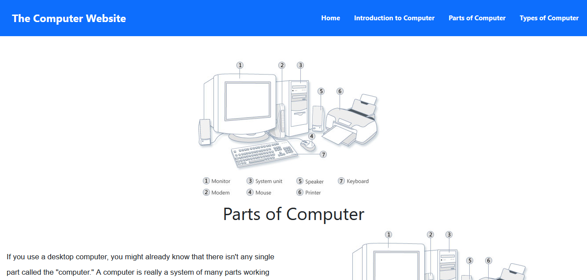
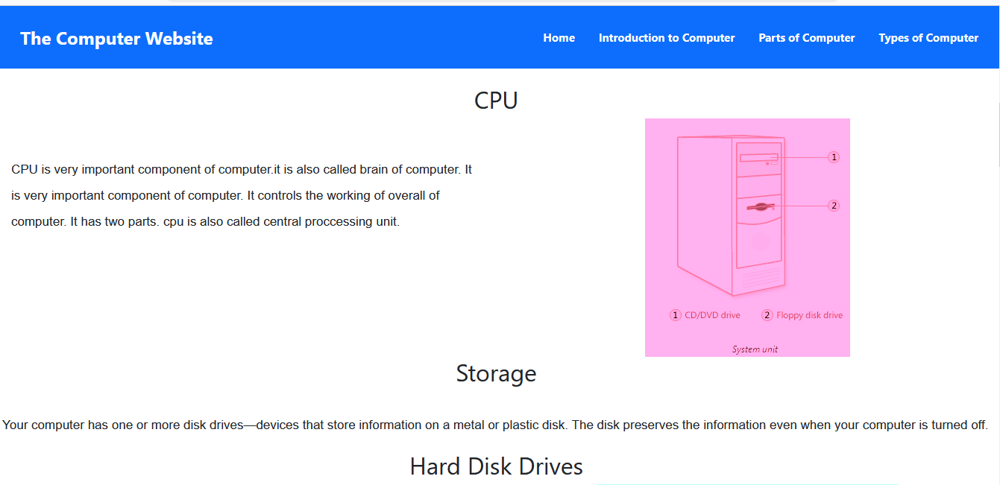
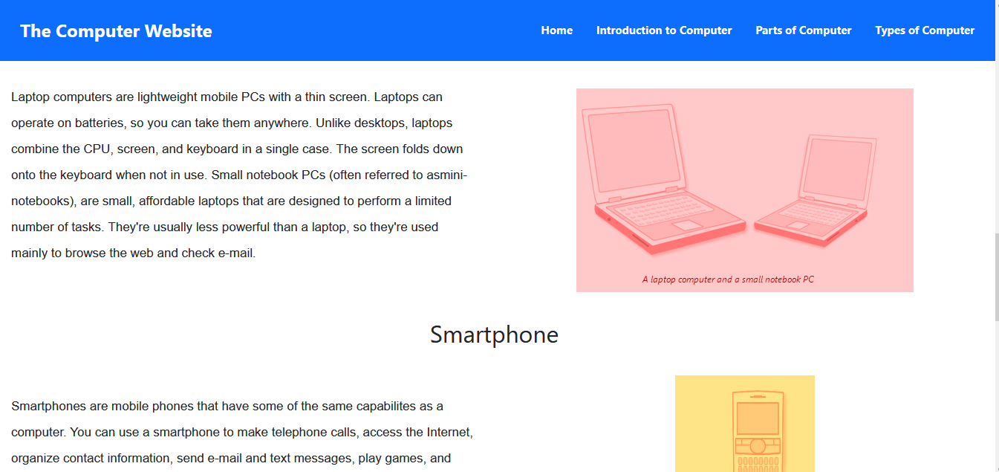

# Computer Learning Website

A responsive **Computer Learning Website** built using **HTML5, CSS3, JavaScript, and Bootstrap**. The website is designed as an educational platform where students can explore computer-related topics through structured study content, images, and an easy-to-use interface.

## Features

* Fully responsive design
* Computer learning and educational content
* Study material organized into different sections
* Informative images throughout the website
* Interactive elements using JavaScript
* Responsive navigation
* Bootstrap components and grid system
* Custom CSS styling
* Mobile, tablet, and desktop support
* Clean and student-friendly interface

## Technologies Used

* **HTML5** – Website structure and educational content
* **CSS3** – Custom styling and page layout
* **JavaScript** – Interactive functionality
* **Bootstrap** – Responsive design and UI components

## Website Content

The website contains educational material related to computers, supported by images to make the topics easier to understand.

The content is presented in a structured way so students can read, explore, and learn different computer concepts.

## Screenshots

Add your website screenshots to the repository and display them here.

Example:

```markdown 

```

You can add multiple screenshots:

markdown








## How to Run

1. Download or clone the repository.
2. Open the project folder.
3. Open `index.html` in a web browser.
4. Explore the different learning sections.

No server is required for the frontend version of this project.

## Responsive Design

The website is designed to work on:

* Desktop
* Laptop
* Tablet
* Mobile

Bootstrap's responsive grid and custom CSS were used to make the website adapt to different screen sizes.

## Purpose of the Project

This project was created to practice frontend web development while building a useful educational website.

It helped me improve my skills in:

* HTML5
* CSS3
* JavaScript
* Bootstrap
* Responsive Web Design
* Website structure and layout
* Creating educational content pages
* Using images effectively in web pages

## Future Improvements

Some possible improvements include:

* User login and registration
* Student progress tracking
* Online quizzes
* Search functionality
* More interactive JavaScript features
* Backend integration
* Database for courses and users
* Admin panel for managing study content

## Author

**Sammir Ahmad**

Frontend Web Development Student
